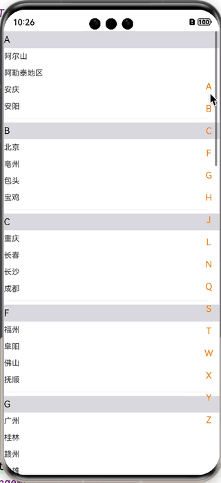

# indexlistview

## 简介

> indexlistview是一款OpenHarmony环境下带索引的城市选择组件。

## 效果展示



## 安装

> ohpm install indexlistview

## 版本和设备

| /             | 版本             |
|---------------|----------------|
| DevEco Studio | 4.1 Canary2    |
| SDK           | **10**             |
| 设备            | Emulator(Next) |

## 属性说明

| 属性                  | 类型               | 含义     | 必传  | 备注    |
|---------------------|------------------|--------|-----|-------|
| clickCallback            | (string) => void | 回调函数   | Y   | 回调给下游 |

## 使用说明

```typescript
import { IndexCityListView } from 'index-listview/Index'
import promptAction from '@ohos.promptAction';
@Entry
@Component
struct Index {
  build() {
    Column() {
      IndexCityListView({
        clickCallback: (city: string) => {
          promptAction.showToast({ message: city })
        }
      })
    }
.width('100%')
  .height('100%')
}
}
```

## 贡献代码

使用过程中发现任何问题都可以提 Issue 给我，当然，我们也非常欢迎你给我发 PR 。

## 开源协议

本项目基于 Apache License 2.0 ，请自由地享受和参与开源。

